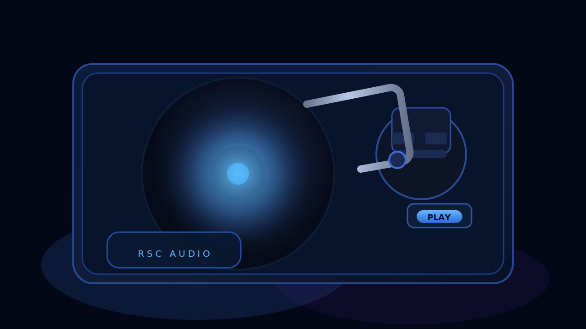

  

    <button
      type="button"
      class="landing__intro-trigger"
      data-role="intro-trigger"
      aria-label="Запустить проигрыватель"
    >
      
        
      
      Включить проигрыватель
      Наведите и нажмите, чтобы музыка зазвучала
    </button>
  

  

    
  

  

    
  

  

    
    
    
  

  <audio
    class="landing__bgm"
    data-role="bgm"
    src="assets/audio/landing-theme.mp3"
    data-src="assets/audio/landing-theme.mp3"
    data-volume="0.6"
    loop
    preload="auto"
  ></audio>

  

    

      RSC // BRIEFING
      

      

        <button
          type="button"
          class="landing__button landing__button--primary is-hidden"
          data-action="advance"
          data-default-label="Подробнее об RSC"
        >
          Подробнее об RSC
        </button>
        <button
          type="button"
          class="landing__button landing__button--secondary is-hidden"
          data-action="explore"
          data-default-label="Я хочу знать больше"
        >
          Я хочу знать больше
        </button>
      

    

  

  <section id="future-content" class="landing-docs" data-role="docs" hidden aria-hidden="true">
    

      

        

      

      

        <header class="landing-docs__titlebar">
          

            
            RSC // ARCHIVE EXPLORER
          

          

            
            
            
          

        </header>
        

          

            <button type="button" class="landing-docs__toolbar-button" disabled>
              ◀
              Назад
            </button>
            <button type="button" class="landing-docs__toolbar-button" disabled>
              ▶
              Вперёд
            </button>
            <button type="button" class="landing-docs__toolbar-button" disabled>
              ⟳
              Обновить
            </button>
          

          

            
            RSC ▸ Документация
          

          <label class="landing-docs__search">
            Поиск по архиву
            <input type="search" placeholder="Поиск по архиву" disabled />
          </label>
        

        

          <aside class="landing-docs__nav" aria-label="Разделы досье RSC">
            Разделы
            

              <button type="button" class="landing-docs__tab is-active" data-docs-target="synopsis" aria-selected="true">
                
                Синопсис
              </button>
              <button type="button" class="landing-docs__tab" data-docs-target="prologue" aria-selected="false">
                
                Пролог
              </button>
              <button type="button" class="landing-docs__tab" data-docs-target="world" aria-selected="false">
                
                Мир
              </button>
              <button type="button" class="landing-docs__tab" data-docs-target="characters" aria-selected="false">
                
                Персонажи
              </button>
            

          </aside>
          

            <article class="landing-docs__panel is-active" data-docs-panel="synopsis">
              <h2>Синопсис</h2>
              
Здесь должен быть синопсис.

            </article>
            <article class="landing-docs__panel" data-docs-panel="prologue" hidden>
              <h2>Пролог</h2>
              
Здесь должен быть пролог.

            </article>
            <article class="landing-docs__panel" data-docs-panel="world" hidden>
              <h2>Мир</h2>
              
Здесь должно быть описание мира.

            </article>
            <article class="landing-docs__panel" data-docs-panel="characters" hidden>
              <h2>Персонажи</h2>
              
Здесь должно быть описание персонажей.

            </article>
          

        

      

      <footer class="landing-docs__taskbar" aria-hidden="true">
        
        RSC DESKTOP · ЗАЩИЩЁННЫЙ КАНАЛ
      </footer>
    

  </section>

