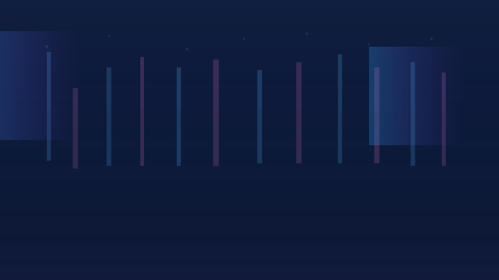
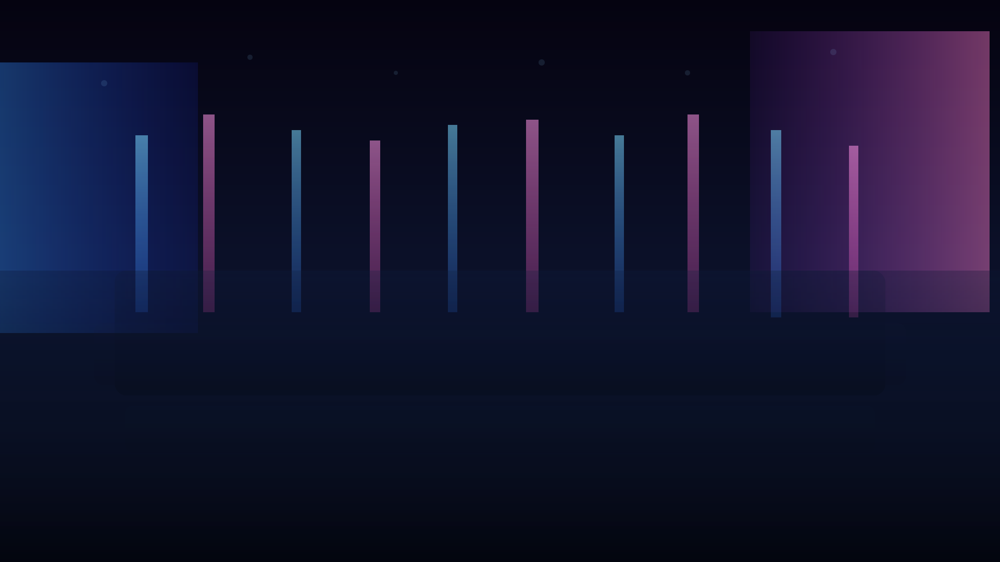

  

    
  

  

    
  

  <audio
    class="landing__bgm"
    data-role="bgm"
    src="assets/audio/landing-theme.mp3"
    data-src="assets/audio/landing-theme.mp3"
    data-volume="0.6"
    loop
    preload="auto"
  ></audio>

  

    

      RSC // BRIEFING
      

      

        <button
          type="button"
          class="landing__button landing__button--primary is-hidden"
          data-action="advance"
          data-default-label="Подробнее об RSC"
        >
          Подробнее об RSC
        </button>
        <button
          type="button"
          class="landing__button landing__button--secondary is-hidden"
          data-action="explore"
          data-default-label="Я хочу знать больше"
        >
          Я хочу знать больше
        </button>
      

    

  

<section id="future-content" hidden>
  <h2>Следующий шаг</h2>
  

    Здесь появятся дополнительные сведения об академии RSC, героях и миссиях. Кнопка «Я хочу знать больше»
    плавно пролистает к этому блоку, как только он будет заполнен.
  

</section>
